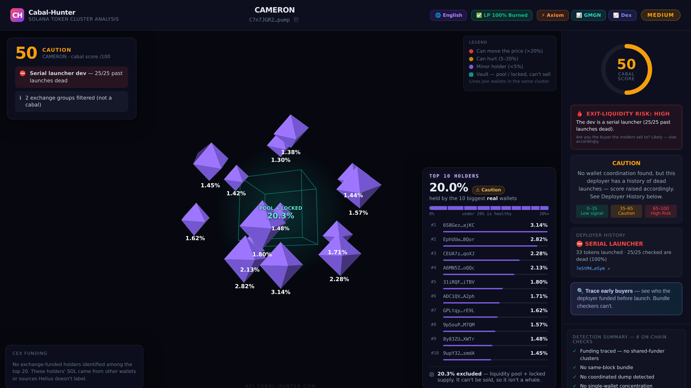

# cabal-hunter-mcp

**On-chain Solana cabal & rug detection as an MCP server.** One tool — `check_cabal_risk` — scans any Solana token mint *before your agent buys* and returns an **Exit-Liquidity Risk** verdict (`SAFE | REVIEW | AVOID`), a 0–100 cabal score, funding-cluster detection, same-block Jito-bundle detection, coordinated-dump detection, serial-launcher **deployer history** ("launched 14, 13 dead"), and a Solana-native **honeypot** check (freeze authority + Token-2022 traps). Every flag links to its on-chain evidence transaction.

[](https://www.npmjs.com/package/cabal-hunter-mcp)
[](https://api.cabal-hunter.com/mcp)
[](https://api.cabal-hunter.com)
[](https://api.cabal-hunter.com/api/info)
[](LICENSE)

> 🌐 **Available in 9 languages:** [English](https://api.cabal-hunter.com/) · [Español](https://api.cabal-hunter.com/es) · [Português](https://api.cabal-hunter.com/pt) · [Français](https://api.cabal-hunter.com/fr) · [Deutsch](https://api.cabal-hunter.com/de) · [Nederlands](https://api.cabal-hunter.com/nl) · [中文](https://api.cabal-hunter.com/zh) · [日本語](https://api.cabal-hunter.com/ja) · [한국어](https://api.cabal-hunter.com/ko)

Contract-clean is **not** cabal-clean. A basic scanner tells you the mint/freeze/LP are fine — it doesn't tell you that 15 wallets funded from one source are holding 30% of supply, waiting to dump on you.

**Credit where it's due:** [RugCheck](https://rugcheck.xyz) also does same-source wallet clustering (their "Insider Networks"), and it's a good tool — if it does what you need, genuinely, use it. What this gives you is one fused exit-liquidity verdict in a single call, at $9/month with no account.

## Quick start

```bash
npx cabal-hunter-mcp
```

No install, no signup, no API key — **250 free scans/month per IP**. That's the whole setup; the command below is what you drop into any MCP client.

### Claude Desktop / Claude Code / Cursor / VS Code / ElizaOS




```json
{
  "mcpServers": {
    "cabal-hunter": {
      "command": "npx",
      "args": ["-y", "cabal-hunter-mcp"]
    }
  }
}
```

Prefer a remote HTTP server (no local process)? Point straight at the hosted endpoint instead:

```json
{ "mcpServers": { "cabal-hunter": { "url": "https://api.cabal-hunter.com/mcp" } } }
```

## The tool

**`check_cabal_risk({ mint })`** — pass a Solana token mint (contract) address. Returns the full forensic JSON:

```jsonc
{
  "recommendation": "AVOID",        // SAFE | REVIEW | AVOID  ← the headline
  "risk": "HIGH",                   // exit-liquidity risk
  "cabal_score": 100,               // 0-100
  "honeypot_risk": "LOW",           // freeze authority + Token-2022 traps
  "mint_authority_revoked": true,
  "freeze_authority_revoked": true,
  "deployer": { "verdict": "SERIAL_LAUNCHER", "tokens_launched": 14, "dead": 13 },
  "coordinated_clusters": [
    { "wallets": 5, "combined_pct": 23.1, "evidence_tx": "https://solscan.io/tx/…" }
  ],
  "time_sync": true,                // same-block (Jito-bundled) buys
  "coordinated_exit": false,        // ≥2 holders dumped together
  "top_reasons": ["..."],
  "wallets_checked": 15,
  "scan_complete": true
}
```

`scan_complete` / `wallets_checked` are included on purpose so your agent can apply **its own** risk tolerance instead of inheriting ours — the score is a starting point you can verify (every cluster carries an `evidence_tx`), not a verdict you take on faith.

### Gate a buy in your agent

> "Before buying any token, call `check_cabal_risk` with the mint. If `recommendation` is `AVOID` or `cabal_score >= 65` or `honeypot_risk` is `HIGH`, skip the trade and say why."

## A note on the withdrawn `trace_funding` tool

An earlier version of this README documented a second tool, `trace_funding`, that traced a token's first buyers back to their funding source. **It has been withdrawn.** This section is the full record of why, including the parts that make us look bad, because a detector nobody can audit is worth nothing.

**The first artifact (July 14).** Its headline detections were not real. The "shared funder" it reported was frequently the token's own pump.fun bonding curve: every seller receives SOL back from the curve, so ordinary selling was being reported as a coordinated cluster. A user caught it by checking one of our findings against an independent tool. We were wrong and the other tool was right.

**The second artifact (July 26) — the same bug wearing a different hat.** Excluding the bonding curve fixed one *address*, not the *class* of mistake. Measuring 323 launches showed an apparent 15% detection rate that was also an artifact: **17 of the 22 flagged "funders" were the liquidity pool's wrapped-SOL vault**, which likewise pays out to anyone who sells. Two fingerprints gave it away — 192 of 193 "clusters" had *every* member already exited, because the group was, by construction, a list of people who had sold. Checking the flagged address against the listed pair address returns a clean bill of health here, and that clean bill is wrong: the vault is a different address from the pair. The real fix is a class rule — only a System-owned account can be a person.

**Then we found we had been measuring the wrong moment entirely.** The trace took its launch timestamp from the token's listed pair, but for a graduated token the only listed pair is the *post-graduation* one. So every measurement we had ever taken — including the ones above — described buyers at **graduation**, not at launch. The actual claim, that a deployer pre-funds wallets which snipe the mint, had never been tested at all.

**The real test.** We rebuilt it against the bonding curve itself, which is where a launch actually happens, and fixed the coverage problem that had been skipping most tokens. Result on the correct window, with the artifact removed: **zero coordinated clusters across 25 launches**, 18 of which had enough buyers for a cluster to be possible.

**What we found instead is more interesting.** On one representative launch, **1,260 of the bonding curve's 1,266 transactions failed**. The median launch has about **five successful buyers**. These launches are not quietly accumulating cabals — they are sniper races where hundreds of bots compete and a handful win. Because a launch has so few winners, tracing the top ten covers essentially *all* of them, which makes that zero a strong result rather than a thin sample.

We would rather withdraw a feature than ship a detector that has never demonstrably detected anything. It may return if a real signal can be shown; until then it is not advertised and not billed. The scanning that `check_cabal_risk` does — holder concentration, same-block bundles, coordinated dumps, deployer track record, honeypot and exit-liquidity checks — is a separate code path that was never affected by any of this, and it carries the System-owned rule described above.

## Pricing

- **250 scans/month per IP — free, no key.**
- After that: **$9/month for Unlimited** (fair use), or pay-as-you-go at **$0.001 USDC per scan** (priced at cost). No signup, no card.
- Prepaid key: send USDC, `POST /api/buy-key`, then set `CABAL_HUNTER_API_KEY` (sent as the `X-API-Key` header). Full details: [api.cabal-hunter.com/pricing](https://api.cabal-hunter.com/pricing).

## Configuration

| Env var | Default | Purpose |
|---|---|---|
| `CABAL_HUNTER_API_KEY` | *(none)* | Prepaid key for unlimited / metered use (`X-API-Key`). |
| `CABAL_HUNTER_API` | `https://api.cabal-hunter.com` | Override the API base URL. |

## Other ways to use Cabal-Hunter

- **REST:** `curl "https://api.cabal-hunter.com/api/scan-cabal?mintAddress=<MINT>"` — [OpenAPI spec](https://api.cabal-hunter.com/openapi.json)
- **ElizaOS plugin:** [`elizaos-plugin-cabal-hunter`](https://github.com/paulf280-ui/plugin-cabal-hunter) (`npm install elizaos-plugin-cabal-hunter`)
- **MCP template / starter:** [solana-safe-sniper-mcp-template](https://github.com/paulf280-ui/solana-safe-sniper-mcp-template)
- **Human?** Free interactive 3D holder map — holders as crystals sized by supply share, clusters joined by beams, with wallets, Solscan receipts, live chart + trade links on one screen: [api.cabal-hunter.com/map](https://api.cabal-hunter.com/map)

## What it detects (why "contract-clean" misses it)

A cabal is 15 fresh wallets — all funded from the same master wallet, all buying in the first seconds of launch — quietly accumulating 25–40% of supply before your bot sees the first candle. Contract clean. LP burned. Everything green. Then they dump, simultaneously, into your liquidity. Cabal-Hunter traces the funding graph on-chain and answers the only question that matters before you sign a swap: **are you the exit liquidity?**

---

MIT licensed. Powered by [Cabal-Hunter](https://api.cabal-hunter.com). This package is a thin MCP wrapper over the hosted API — the detection runs server-side against live Solana on-chain data (Helius RPC).
